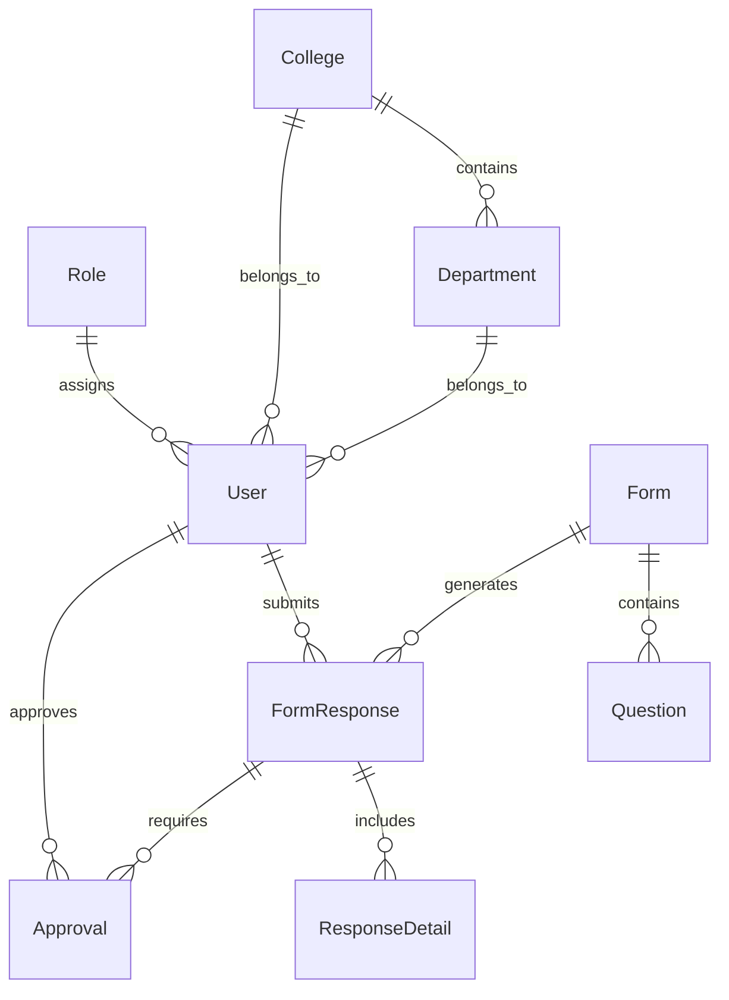
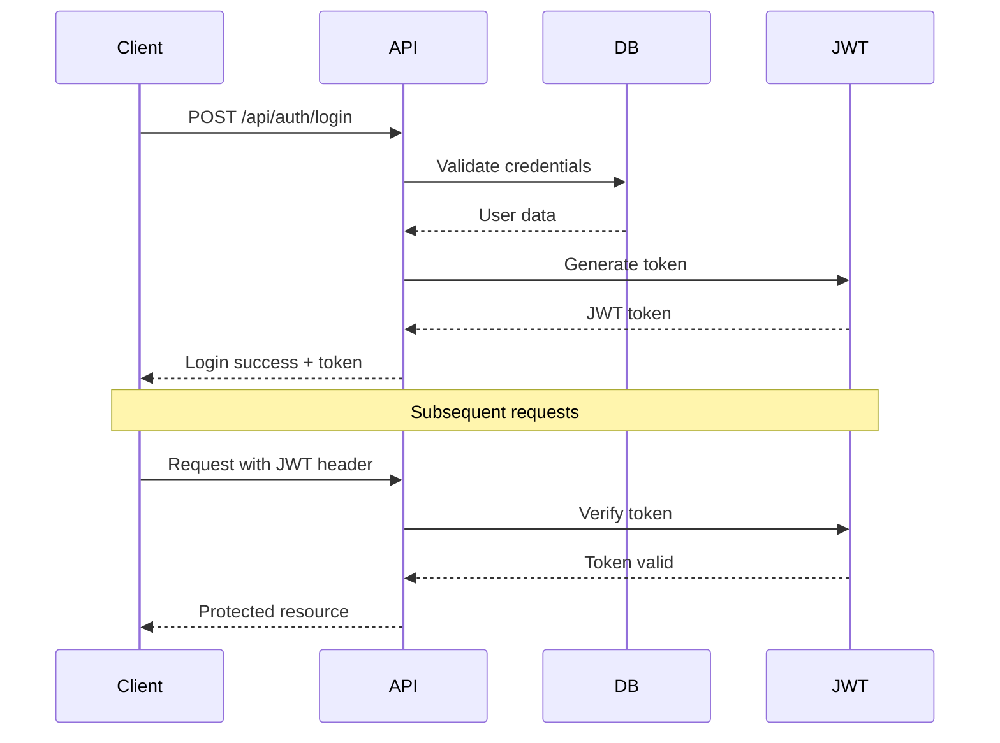

<div align="center">

# 🚫📋Calo: Document Approval System - Backend API

*Streamlining Administrative Processes Through Digital Innovation*

[](https://nodejs.org/)
[](https://expressjs.com/)
[](https://postgresql.org/)
[](https://jwt.io/)

---

**A comprehensive form management and approval workflow system built with Node.js, Express, and PostgreSQL. This system streamlines administrative processes by providing digital forms with multi-step approval workflows.**

</div>

## ✨ Features

<table>
<tr>
<td>

🔐 **Authentication & Authorization**

- JWT-based authentication
- Role-based access control
- Secure password hashing

</td>
<td>

📝 **Form Management**

- Dynamic form creation
- Custom question types
- Form validation & logic

</td>
</tr>
<tr>
<td>

⚡ **Approval Workflows**

- Multi-step approval processes
- Role-based approvers
- Status tracking & notifications

</td>
<td>

📊 **Analytics & Monitoring**

- Administrative dashboards
- Real-time insights
- Request logging & monitoring

</td>
</tr>
</table>

### 🎯 Key Capabilities

- **🏫 Organizational Structure** - College and department-based user management
- **🔔 Real-time Notifications** - Instant updates on form submissions and approvals
- **👥 Role Management** - Support for Student, Admin, Dean, HOD, and coordinator roles

## 🏗️ Architecture

The application follows a RESTful API architecture with the following structure:

```text
backend/
├── config/          # Database configuration
├── controllers/     # Request handlers and business logic
├── middleware/      # Authentication and logging middleware
├── models/          # Sequelize database models
├── routes/          # API route definitions
├── services/        # Additional services (if any)
├── index.js         # Application entry point
└── seeder.js        # Database seeder script
```

## 🛠️ Technology Stack

<div align="center">

| Category | Technology | Purpose |
|:--------:|:----------:|:-------:|
| 🚀 **Runtime** | Node.js | Server-side JavaScript runtime |
| 🌐 **Framework** | Express.js | Web application framework |
| 🗄️ **Database** | PostgreSQL | Relational database management |
| 🔧 **ORM** | Sequelize | Database object-relational mapping |
| 🔐 **Authentication** | JWT | Token-based authentication |
| 🔒 **Security** | bcrypt | Password hashing |
| ⚙️ **Config** | dotenv | Environment variable management |
| 🔄 **Development** | nodemon | Auto-restart development server |

</div>

## 📋 Prerequisites

> ⚠️ **Important**: Make sure you have these installed before proceeding

```bash
# Check your versions
node --version    # Should be v14 or higher
pnpm --version    # Package manager
psql --version    # PostgreSQL client
```

**Required:**

- 🟢 **Node.js** (v14 or higher)
- 🐘 **PostgreSQL** database
- 📦 **pnpm** package manager

## ⚙️ Installation & Setup

### 🚀 Quick Start

<details>
<summary>📦 1. Clone and Install</summary>

```bash
# Clone the repository
git clone https://github.com/samohiani/document-approval-system.git
cd document-approval-system

# Install dependencies
pnpm install
```

</details>

<details>
<summary>🔧 2. Environment Configuration</summary>

Create a `.env` file in the root directory:

```env
# Server Configuration
PORT=5000

# Database Configuration
DB_HOST=localhost
DB_USERNAME=your_db_username
PASSWORD=your_db_password
DB_NAME=calo

# Security
JWT_SECRET=your_jwt_secret_key
```

> 💡 **Tip**: Use a strong, random JWT secret in production
</details>

<details>
<summary>🗄️ 3. Database Setup</summary>

```bash
# Create PostgreSQL database
createdb calo

# Seed the database with initial data
node seeder.js
```

</details>

<details>
<summary>🎯 4. Start the Server</summary>

```bash
# Development mode (with auto-reload)
pnpm run dev

# Production mode
pnpm start
```

✅ **Success!** Your API will be available at `http://localhost:5000`
</details>

## 🔗 API Endpoints

<div align="center">

### 🎯 Quick Reference

| Endpoint Category | Base URL | Description |
|:------------------|:---------|:------------|
| 🔐 **Auth** | `/api/auth` | Authentication & registration |
| 📝 **Forms** | `/api/forms` | Form management |
| ❓ **Questions** | `/api/questions` | Form questions |
| 📋 **Responses** | `/api/response` | Form submissions |
| ✅ **Approvals** | `/api/approval` | Approval workflows |
| 🔔 **Notifications** | `/api/notifications` | User notifications |
| 📊 **Dashboard** | `/api/dashboard` | Analytics & stats |
| 👥 **Admin** | `/api/admin` | User & role management |

</div>

---

### 🔐 Authentication

| Method | Endpoint | Description | Auth Required |
|:------:|:---------|:------------|:-------------:|
| `POST` | `/api/auth/login` | User login | ❌ |
| `POST` | `/api/auth/register` | User registration | ❌ |

### 📝 Forms Management

| Method | Endpoint | Description | Auth Required |
|:------:|:---------|:------------|:-------------:|
| `GET` | `/api/forms` | Get all forms | ✅ |
| `POST` | `/api/forms` | Create new form | ✅ |
| `GET` | `/api/forms/:id` | Get specific form | ✅ |
| `PUT` | `/api/forms/:id` | Update form | ✅ |
| `DELETE` | `/api/forms/:id` | Delete form | ✅ |

### ❓ Questions

| Method | Endpoint | Description | Auth Required |
|:------:|:---------|:------------|:-------------:|
| `GET` | `/api/questions` | Get questions for a form | ✅ |
| `POST` | `/api/questions` | Add question to form | ✅ |
| `PUT` | `/api/questions/:id` | Update question | ✅ |
| `DELETE` | `/api/questions/:id` | Delete question | ✅ |

### 📋 Responses

| Method | Endpoint | Description | Auth Required |
|:------:|:---------|:------------|:-------------:|
| `GET` | `/api/response` | Get form responses | ✅ |
| `POST` | `/api/response` | Submit form response | ✅ |
| `GET` | `/api/response/:id` | Get specific response | ✅ |

### ✅ Approvals

| Method | Endpoint | Description | Auth Required |
|:------:|:---------|:------------|:-------------:|
| `GET` | `/api/approval` | Get approval workflows | ✅ |
| `POST` | `/api/approval/approve` | Approve a submission | ✅ |
| `POST` | `/api/approval/reject` | Reject a submission | ✅ |

### 🔔 Notifications

| Method | Endpoint | Description | Auth Required |
|:------:|:---------|:------------|:-------------:|
| `GET` | `/api/notifications` | Get user notifications | ✅ |
| `POST` | `/api/notifications/mark-read` | Mark notifications as read | ✅ |

### 📊 Dashboard

| Method | Endpoint | Description | Auth Required |
|:------:|:---------|:------------|:-------------:|
| `GET` | `/api/dashboard/stats` | Get dashboard statistics | ✅ |

### 👥 Admin

| Method | Endpoint | Description | Auth Required |
|:------:|:---------|:------------|:-------------:|
| `GET` | `/api/admin/users` | Manage users | ✅ |
| `POST` | `/api/admin/roles` | Manage roles | ✅ |

## 🗄️ Database Models

### 📊 Entity Relationship Overview



### 🏗️ Core Models

<table>
<tr>
<td width="50%">

**👤 User Management**

- **User** - System users with authentication
- **Role** - Access control (student, admin, dean, etc.)
- **College** - Academic institutions
- **Department** - Academic departments

</td>
<td width="50%">

**📋 Form System**

- **Form** - Dynamic forms with metadata
- **Question** - Form questions with validation
- **FormResponse** - User form submissions
- **ResponseDetail** - Individual question answers

</td>
</tr>
<tr>
<td>

**✅ Workflow Management**

- **Approval** - Approval workflow steps
- **ApprovalFlow** - Process definitions
- **Notification** - System notifications

</td>
<td>

**🔄 Process Flow**

```
Form → Questions → Response → Approval → Notification
```

</td>
</tr>
</table>

## 🔐 Authentication & Authorization

### 🎭 Role-Based Access Control

<div align="center">

| Role | Icon | Access Level | Permissions |
|:-----|:----:|:-------------|:------------|
| **Student** | 🎓 | Basic | Submit forms, view own submissions |
| **Admin** | 👑 | Full Access | Complete system control |
| **College Dean** | 🏛️ | College Level | Approve college submissions |
| **HOD** | 🏢 | Department Level | Approve department submissions |
| **Dean SPS** | 📚 | Postgraduate | School of Postgraduate Studies |
| **Sub-Dean SPS** | 📖 | Postgraduate | Assistant SPS operations |
| **PG Coordinator** | 🎯 | Program Level | Postgraduate program coordination |

</div>

### 🔑 Authentication Flow



## 📝 Logging & Monitoring

### 📊 System Monitoring

<table>
<tr>
<td align="center">

**🗄️ Database Logs**  
`sequelize.log`  
*SQL queries & performance*

</td>
<td align="center">

**🌐 HTTP Logs**  
`access.log`  
*API requests & responses*

</td>
<td align="center">

**⚙️ Custom Tracking**  
*Middleware logging*  
*API usage analytics*

</td>
</tr>
</table>

### 📈 What's Being Tracked

- ✅ All database queries and execution times
- ✅ HTTP request/response cycles
- ✅ Authentication attempts
- ✅ API endpoint usage patterns
- ✅ Error occurrences and stack traces

## 🧪 Development

### 🚀 Development Commands

```bash
# 🔄 Run in development mode (auto-reload)
pnpm run dev

# 🗄️ Reset and seed database
node seeder.js

# 📦 Install new dependencies
pnpm add <package-name>

# 🧹 Clean install
rm -rf node_modules pnpm-lock.yaml && pnpm install
```

### 🔧 Development Tips

> 💡 **Hot Reloading**: Use `pnpm run dev` for automatic server restarts  
> 🗄️ **Database Reset**: Run `node seeder.js` to reset data  
> 📋 **API Testing**: Use tools like Postman or Thunder Client  
> 🔍 **Debugging**: Check `sequelize.log` for database issues

## 🚦 HTTP Status Codes

<div align="center">

| Status | Code | Meaning | When Used |
|:------:|:----:|:--------|:----------|
| ✅ | `200` | **Success** | Request completed successfully |
| 🆕 | `201` | **Created** | Resource created successfully |
| ❌ | `400` | **Bad Request** | Invalid request data |
| 🔒 | `401` | **Unauthorized** | Authentication required |
| 🚫 | `403` | **Forbidden** | Access denied |
| 🔍 | `404` | **Not Found** | Resource doesn't exist |
| 💥 | `500` | **Server Error** | Internal server error |

</div>

## 📄 API Response Format

### 📋 Standard Response Structure

All API responses follow this consistent format:

```json
{
  "status": "success" | "error",
  "message": "Human-readable response message",
  "data": {
    // Response payload goes here
  }
}
```

### 📝 Example Responses

<details>
<summary>✅ Success Response</summary>

```json
{
  "status": "success",
  "message": "Form created successfully",
  "data": {
    "id": 123,
    "title": "Student Application Form",
    "created_on": "2025-06-15T10:30:00Z"
  }
}
```

</details>

<details>
<summary>❌ Error Response</summary>

```json
{
  "status": "error",
  "message": "Authentication required",
  "data": []
}
```

</details>

## 🤝 Contributing

### 🛠️ Development Workflow

```mermaid
gitgraph
    commit id: "Initial"
    branch feature
    checkout feature
    commit id: "Add feature"
    commit id: "Tests"
    checkout main
    merge feature
    commit id: "Release"
```

### 📋 Contribution Steps

1. **🍴 Fork** the repository
2. **🌿 Create** a feature branch (`git checkout -b feature/amazing-feature`)
3. **💻 Make** your changes
4. **✅ Test** your changes thoroughly
5. **📝 Commit** your changes (`git commit -m 'Add amazing feature'`)
6. **🚀 Push** to the branch (`git push origin feature/amazing-feature`)
7. **🔄 Submit** a pull request

### � Code Standards

- ✅ Follow existing code style
- ✅ Add comments for complex logic
- ✅ Update documentation if needed
- ✅ Test your changes before submitting

---

<div align="center">

## �📜 License

This project is licensed under the **ISC License**.

---

### 🎯 Built with ❤️ for Educational Excellence

**Streamlining administrative processes in educational institutions**

[](https://nodejs.org/)
[](https://expressjs.com/)
[](https://postgresql.org/)

*Skip the paperwork, embrace efficiency! 🚀*

</div>
